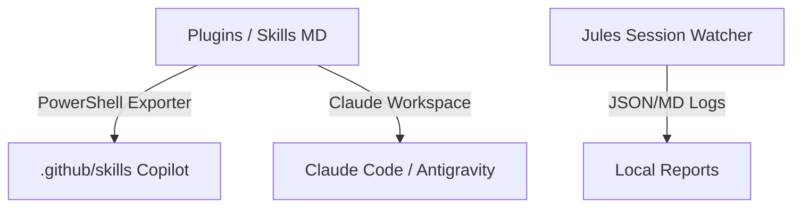
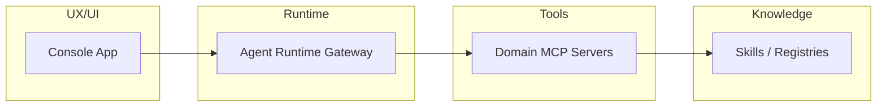

# Medusa Agentic Operating Layer — AS-IS to TO-BE Architecture Proposal

Este documento descreve a transição arquitetural da coleção atual de skills estáticas para uma camada operacional ativa, modular e padronizada (MCP) para o Medusa Framework, compatível com qualquer LLM provider e agentic framework.

---

## 1. Arquitetura Atual (AS-IS)

### Visão Geral

Atualmente, o repositório é composto por:

* **Coleção de Skills (`plugins/`)**: Instruções estáticas em Markdown (`SKILL.md`) que descrevem regras operacionais específicas do framework Medusa.
* **Ferramenta de Exportação (`tools/`)**: Scripts PowerShell que convertem as estruturas de pasta de skills do Claude/Antigravity para o padrão do GitHub Copilot CLI (`.github/skills`).
* **Relatórios e Auditoria (`reports/`)**: Logs de execução, relatórios forenses de tradução e estados de sessões do agente Jules.



### Regras de Negócio e Convenções Normativas Existentes

* **Camadas do Medusa.js v2**: A implementação segue estritamente a convenção `Module → Workflow → API Route → Frontend`.
* **Tratamento de Mutação**: Toda e qualquer mutação de estado ou banco de dados deve ocorrer exclusivamente através de um **Medusa Workflow**. Chamadas diretas a serviços em rotas são proibidas.
* **Uso de SDK**: A integração do storefront e painel admin com o backend Medusa é feita via SDK oficial, proibindo requisições HTTP (`fetch`) genéricas sem tratamento.
* **FinOps e Localização**: Resoluções de conflitos linguísticos seguem um validador AST rigoroso localmente para prevenir falsos positivos, garantindo integridade das âncoras e code blocks.

---

## 2. Arquitetura Proposta (TO-BE)

A evolução arquitetural propõe a reestruturação do repositório em quatro planos operacionais e de governança bem definidos: **Knowledge, Tools, Runtime e UX/UI**.

```
medusa-agent-skills/
├── plugins/                         # Camada de conhecimento e instruções (Knowledge)
├── mcps/                            # Servidores MCP operacionais (Tools)
├── packages/                        # Adapters e bibliotecas de portabilidade (Runtime)
├── apps/                            # Console de governança e monitoramento (UX)
├── registries/                      # Registros e catálogos unificados
└── schemas/                         # Definições formais de contratos e dados
```

### Os Quatro Planos



1. **Knowledge Plan (Camada de Conhecimento)**:
   * Mantém e expande as diretrizes e regras base do Medusa v2.
   * Centraliza registros estruturados em arquivos JSON (`registries/`).
2. **Tools Plan (Camada de Ferramentas / MCPs)**:
   * Substitui a leitura puramente textual de documentação estática por ferramentas executáveis expostas via **Model Context Protocol (MCP)**.
   * Cria servidores MCP especializados por domínio (ex: `medusa-architecture`, `medusa-workflow`, `medusa-storefront`).
3. **Runtime Plan (Camada de Adaptação de Agentes)**:
   * Abstrai os frameworks de orquestração através de um gateway unificado (`Agent Runtime Gateway`).
   * Fornece conectores portáveis para CrewAI, LangGraph, Mastra, OpenAI Agents, Semantic Kernel, Vercel AI SDK, Agno, entre outros.
4. **UX Plan (Painel de Operações)**:
   * Interface gráfica (`apps/console`) para auditoria de execuções de agentes em tempo real.
   * Dashboard de aprovação humana de planos de execução (`Approval Gate`) e verificação de evidências de alteração de código.

---

## 3. Modelo Operacional Focado em Medusa.js v2

Qualquer agente ou MCP atuando sob esta especificação deve validar estritamente a conformidade das seguintes estruturas nucleares do framework:

### Módulos Medusa

* **Data Model**: Definições das tabelas e relacionamentos via DML.
* **Service**: Classes que herdam de `MedusaService` expondo métodos CRUD básicos.
* **Migration**: Presença e correta sintaxe das migrations geradas via CLI.
* **Definição**: Exportação correta em `src/modules/<module-name>/index.ts`.

### Workflows Medusa

* **Steps**: Passos com tipagens e dependências resolvidas no container.
* **Compensation**: Presença de lógica de compensação para rollback automático de steps que realizam mutação.
* **Syntax**: Proibição de funções assíncronas do tipo "arrow function" na definição do workflow para não corromper o grafo interno de execução da engine do Medusa.

### API Routes Medusa

* **Scope**: Rotas nos subdiretórios corretos (`src/api/admin/` ou `src/api/store/`).
* **Validation**: Uso de schemas do **Zod** para validação obrigatória do body.
* **Auth**: Inclusão de middlewares apropriados de autenticação (como `authenticate("admin", "bearer")`).

### Storefront e Admin UI

* **Hooks**: Uso dos wrappers oficiais do React Query expostos pelo SDK.
* **UX States**: Presença obrigatória de estados de carregamento, erro, vazio (empty) e sucesso em interfaces interativas.
* **Formatação de Preços**: Exibição e manipulação de valores brutos conforme retornado pelo backend, evitando re-multiplicações incorretas localmente.

---

## 4. Segurança e Governança Anti-Vazamento

* **Secret Scanning**: Execução obrigatória de gateways locais para impedir o push de tokens ou credenciais mascaradas.
* **Redação de Metadados**: Relatórios operacionais (`repo-resolution-report.json`) nunca devem versionar fragmentos de API keys, hashes ou prefixos de autenticação sob qualquer pretexto.
* **Isolamento de Credenciais**: O arquivo `.env.local` é classificado como zona de infraestrutura estritamente local e mantido fora do ciclo de vida do repositório Git.
